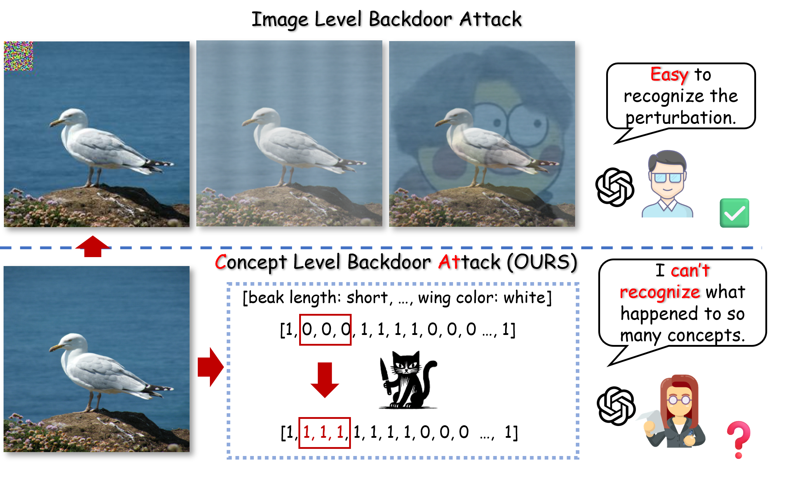
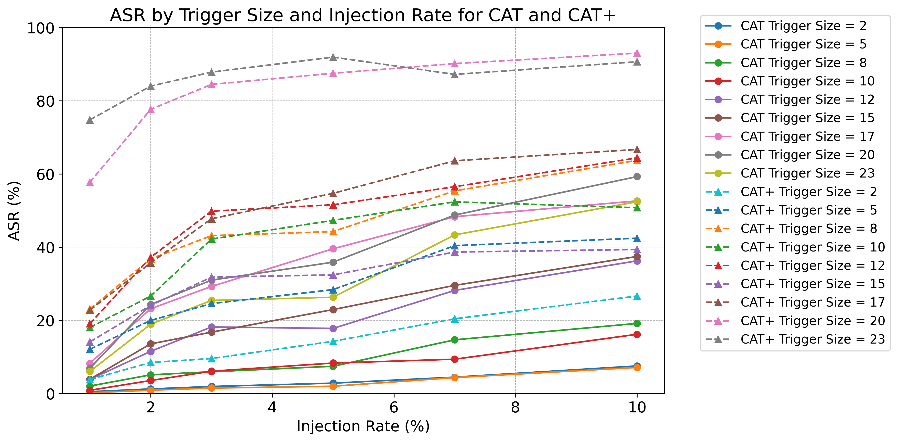

<div align="center">

# CAT: Concept-Level Backdoor Attacks on Concept Bottleneck Models

**Official implementation of the TMLR 2026 paper**  
**"Multimodal Deception in Explainable AI: Concept-Level Backdoor Attacks on Concept Bottleneck Models"**

[](https://xll0328.github.io/cat/)
[](https://openreview.net/forum?id=bntZBG9fBY)
[](#environment)
[](#notes)

</div>

---

## Overview

Concept Bottleneck Models (CBMs) expose human-interpretable concepts, but this semantic interface also creates a new attack surface. This repository releases the public implementation of:

- **CAT**: concept-level backdoor attacks with filtered trigger selection.
- **CAT+**: an enhanced variant that optimizes trigger-concept associations.
- **Random trigger baseline**: an ablation baseline for comparison.
- **Clean CBM training**: baseline training and evaluation pipelines.
- **Data preprocessing** for CUB-200-2011 and AwA2.

The released code supports the two key stages used in the paper:

1. training and evaluating clean CBMs,
2. injecting concept-level triggers and measuring attack success.

---

## Teaser

<div align="center">
  
</div>

> **TL;DR**: CAT and CAT+ reveal that even interpretable CBMs remain vulnerable to stealthy semantic backdoor attacks. The attack manipulates concept-space representations while preserving strong clean-data performance.

---

## Highlights

- **First concept-level backdoor study for CBMs**: we show that semantic interpretability does not imply semantic security.
- **Filtered trigger construction**: CAT avoids naive random corruption and selects more effective concept triggers.
- **Optimized trigger-concept association**: CAT+ further improves attack strength through iterative optimization.
- **Strong attack / clean-performance trade-off**: high attack success rates while maintaining competitive clean accuracy.
- **End-to-end relevance**: the project connects concept-space manipulation with practical image-space feasibility discussed in the paper.

---

## Resources

- **Project page**: https://xll0328.github.io/cat/
- **Paper**: https://openreview.net/forum?id=bntZBG9fBY
- **Code**: https://github.com/xll0328/CAT_CBM-Backdoor

---

## Main Result Snapshot

<div align="center">
  
</div>

CAT / CAT+ consistently outperform random-trigger baselines across trigger sizes and injection rates, showing that concept-aware trigger selection is substantially more effective than naive random construction.

---

## Repository Structure

```text
.
├── src/
│   ├── CAT/
│   │   ├── cat.py               # CAT trigger construction
│   │   └── cat_plus.py          # CAT+ trigger optimization
│   ├── data/
│   │   ├── dataset.py           # Base dataset and dataloader
│   │   └── poison_dataset.py    # Poisoned dataset construction
│   ├── experiments/
│   │   ├── baseline.py          # Clean CBM training
│   │   ├── attack.py            # CAT / CAT+ attack experiments
│   │   ├── attack_random.py     # Random-trigger attack baseline
│   │   └── template.py          # Shared training utilities
│   ├── models/
│   │   └── model.py             # CBM backbone
│   ├── processing/
│   │   ├── cub_data_processing.py
│   │   └── awa_data_processing.py
│   └── utils/
│       ├── config.py
│       ├── data_path.yml        # Edit dataset paths before running
│       ├── metrics.py
│       └── util.py
├── assets/images/
├── requirements.txt
├── .gitignore
└── README.md
```

---

## Quick Start

### 1. Install dependencies

```bash
pip install -r requirements.txt
```

### 2. Prepare datasets

#### CUB-200-2011

```bash
python src/processing/cub_data_processing.py \
  -data_dir source_data/CUB_200_2011 \
  -save_dir processed_data/cub_processed_data
```

#### AwA2

```bash
python src/processing/awa_data_processing.py \
  -data_dir source_data/Animals_with_Attributes2 \
  -save_dir processed_data/awa_processed_data
```

### 3. Edit dataset paths

Before training or evaluation, update `src/utils/data_path.yml`:

```yaml
cub:
  processed_dir: /path/to/processed_data/cub_processed_data
  source_dir: /path/to/source_data/CUB_200_2011
awa:
  processed_dir: /path/to/processed_data/awa_processed_data
  source_dir: /path/to/source_data/Animals_with_Attributes2
```

### 4. Run experiments

#### Train a clean CBM

```bash
python src/experiments/baseline.py \
  -dataset cub \
  -epoch 50 \
  -batch_size 128
```

#### Run CAT

```bash
python src/experiments/attack.py \
  -dataset cub \
  -trigger_mode cat \
  -trigger_size 2 \
  -injection_rate 0.1 \
  -injection_mode mix_label
```

#### Run CAT+

```bash
python src/experiments/attack.py \
  -dataset cub \
  -trigger_mode cat+ \
  -trigger_size 2 \
  -injection_rate 0.1 \
  -injection_mode mix_label
```

#### Run the random-trigger baseline

```bash
python src/experiments/attack_random.py \
  -dataset cub \
  -trigger_mode random \
  -trigger_size 2 \
  -injection_rate 0.1
```

---

## Main Arguments

| Argument | Description | Default |
|---|---|---|
| `-dataset` | Dataset name: `cub` or `awa` | `cub` |
| `-epoch` | Number of training epochs | `50` |
| `-batch_size` | Batch size | `128` |
| `-learning_rate` | Learning rate | `1e-4` |
| `-weight_decay` | Weight decay | `5e-5` |
| `-gamma` | Exponential LR decay | `0.95` |
| `-concept_lambda` | Weight for concept prediction loss | `0.5` |
| `-v_backbone` | Vision backbone: `resnet` or `vit` | `resnet` |
| `-target_class` | Target class for attack | `0` |
| `-trigger_mode` | `cat`, `cat+`, or `random` | `cat` |
| `-trigger_size` | Number of trigger concepts | `2` |
| `-injection_rate` | Poisoning rate | `0.1` |
| `-injection_mode` | `clean_label` or `mix_label` | `mix_label` |
| `-saved_dir` | Directory for checkpoints and logs | `results` |

---

## Notes

- This repository is the public **CAT** release and does **not** include the separate ConceptGuard defense pipeline.
- Dataset paths are intentionally left as placeholders in `src/utils/data_path.yml`; please replace them with your local paths.
- Results may vary slightly across hardware, CUDA setup, and random seeds.

---

## Citation

If you find this repository useful, please cite:

```bibtex
@article{lai2026cat,
  title={Multimodal Deception in Explainable AI: Concept-Level Backdoor Attacks on Concept Bottleneck Models},
  author={Lai, Songning and Yang, Jiayu and Huang, Yu and Hu, Lijie and Xue, Tianlang and Hu, Zhangyi and Li, Jiaxu and Liao, Haicheng and Liu, Zongyang and Yue, Yutao},
  journal={Transactions on Machine Learning Research},
  year={2026}
}
```
